# UiPath - RPA

## Instalação da versão community do UiPath Studio

O UiPath Studio Community é a ferramenta utilizada para aprender sobre RPA e conhecermos mais sobre as features disponíveis pela UiPath, neste tutorial vamos instalar a versão 2017.1 Moonlight de 14 de Agosto de 2017 [leia mais](https://www.uipath.com/release-notes).

### 1) Download

**acesse o link abaixo:**   
 https://www.uipath.com/community

**click no botão "GET COMMUNITY EDITION"**

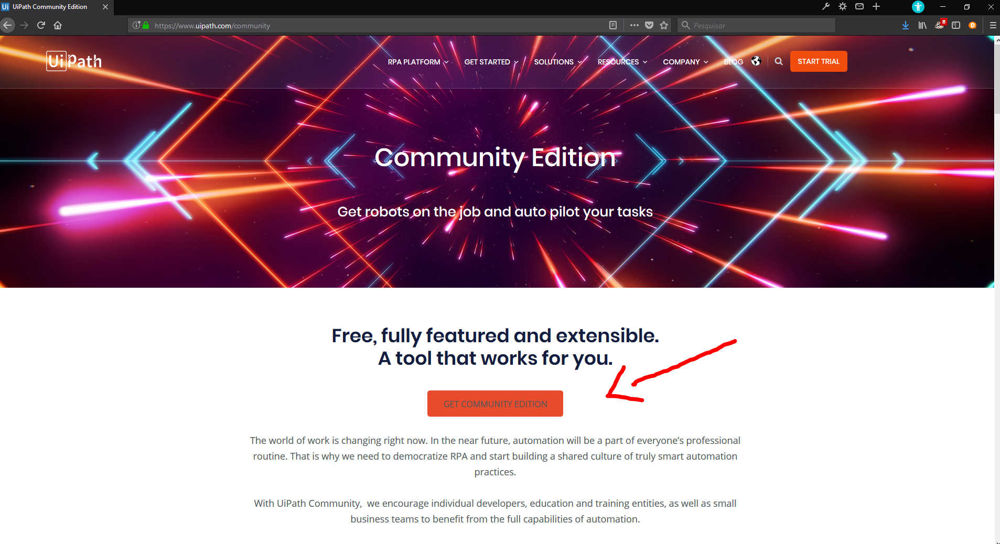

**Preencha seus dados pessoas e clicar no botão "REQUEST COMMUNITY EDITION"**
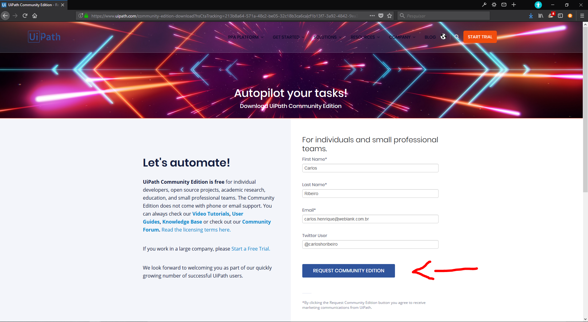

**Depois de clicar no botão você será redirecionado para a página abaixo então clique em "here" (conforme a imagem 1) e depois no executável para instalar (conforme imagem 2)**
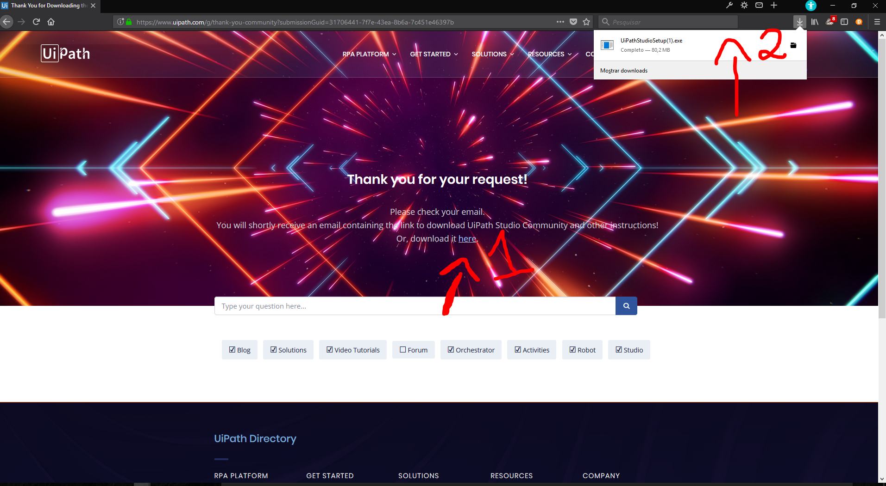

*observação: neste momento vai depender muito do seu navegador, neste caso, eu estava usando o firefox.*

### 2) Instalação

**clique no botão "Run"**
*pode ser que no seu computador aparecam variações da palavra Run, dependendo da versão do SO e lingua instalada *
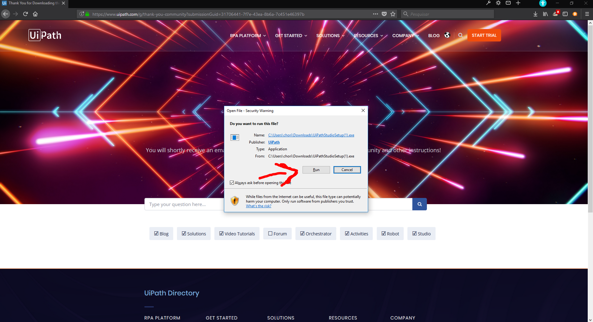

**você vai ver algo parecido com a imagem abaixo.**
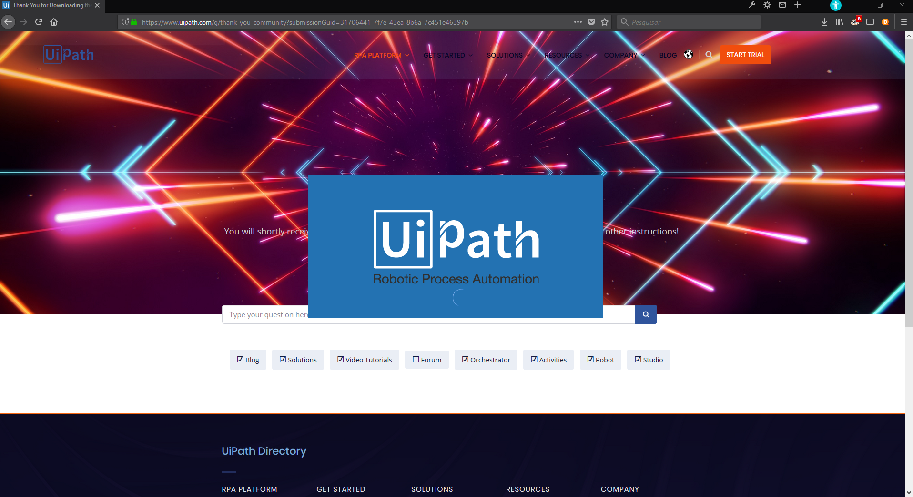

### 3) Configurar licença community

**clique na opção "Start Free"**
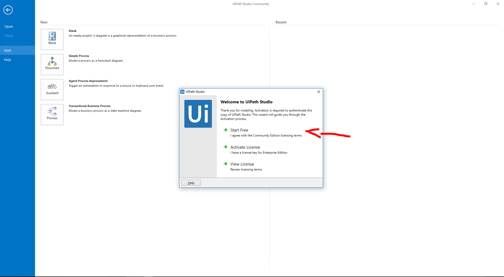

**insira o mesmo e-mail que colocou no site e clique "Activate"**
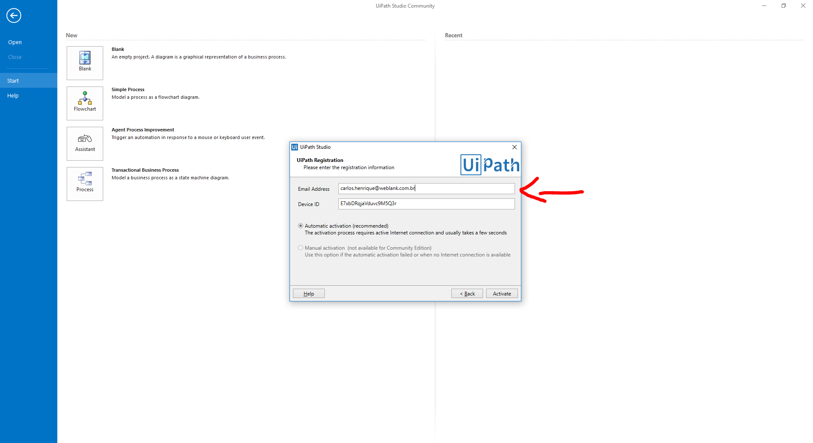

### 4) Parabéns !!!

**A configuração da licença vai encerrar com a abertura desta página na web**
*se apareceu a página abaixo para você, parabéns! Terminou a instalação*
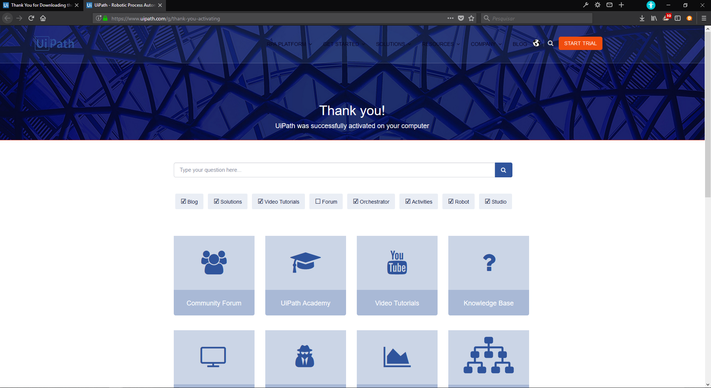

## Bônus - Aproveitando 100% - Instalação dos pacotes

**Crie um projeto qualquer, no exemplo abaixo usei um sample da própria UiPath**
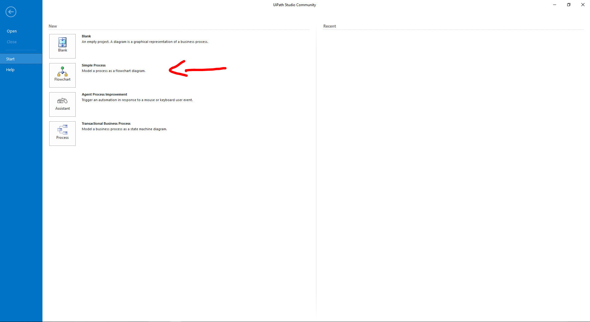

**Agora vai precisar clicar no ico do gerenciador de pacotes**
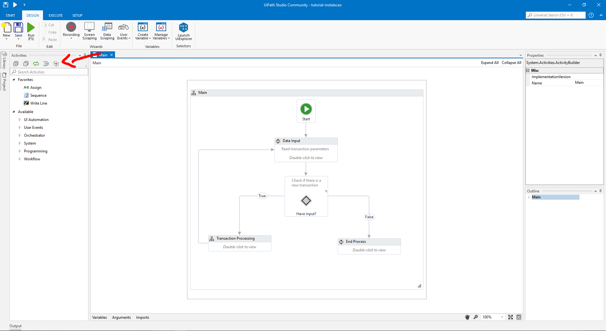

**MUITO IMPORTANTE** 
1) clique no em todos all availables (canto superior esquerdo)
2) ajuste os filtros, deixando igual a imagem abaixo
3) instala todas as bibliotecas, sem dó!

*observação: existe mais de uma página de bibliotecas então não esqueça de passar as páginas (conforme circulado na imagem)*

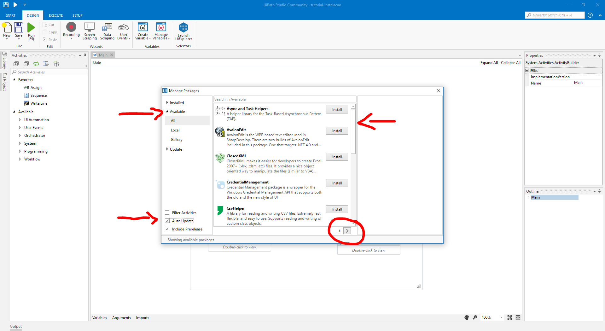

### AGORA ESTAMOS PRONTOS PARA CRIAR QUALQUER PROJETO! BONS ESTUDOS!

## Contribuindo

Você também pode escrever as suas dicas! É muito fácil, basta enviar um PR para este repositório criando com o seu material proposto, lembre de cabrichar ;) 

Conto com os comentários e sugestões de vocês nas issues para melhorar o desenvolvimento deste repositório. 

## [License](https://github.com/weblank/UiPath-Brasil/blob/master/LICENSE) 
